# Hello, World! - C


C is a [general-purpose](https://en.wikipedia.org/wiki/General-purpose_programming_language) computer programming language. It was created in the 1970s by [Dennis Ritchie](https://en.wikipedia.org/wiki/Dennis_Ritchie), and remains very widely used and influential. By design, C's features cleanly reflect the capabilities of the targeted CPUs. It has found lasting use in [operating systems](https://en.wikipedia.org/wiki/Operating_system), [device drivers](https://en.wikipedia.org/wiki/Device_drivers), and [protocol stacks](https://en.wikipedia.org/wiki/Protocol_stack), but its use in application software has been decreasing. C is commonly used on computer architectures that range from the largest supercomputers to the smallest [microcontrollers](https://en.wikipedia.org/wiki/Microcontroller) and [embedded systems](https://en.wikipedia.org/wiki/Embedded_system).

> [C (programming language) - Wikipedia](https://en.wikipedia.org/wiki/C_(programming_language))


## Hello, World in C

```c
#include <stdio.h>

int main() {
    printf("Hello, World!\n");
    return 0;
}
```

### Compile and Run


- `gcc` is the GNU Compiler Collection, which can compile C, C++, Objective-C, Fortran, and Ada.

    to compile a C program:

    ```bash
    gcc -o hello hello.c
    ```

- `g++` is a program that calls `gcc` with the `-lstdc++` flag, which links against the C++ standard library.

    to compile a C program:

    ```bash
    g++ -o hello hello.c
    ```

- `llvm` is a collection of modular and reusable compiler and toolchain technologies.

    to compile a C program:

    ```bash
    llvm-gcc -o hello hello.c
    ```

- `clang` is a C, C++, and Objective-C compiler which encompasses preprocessing, parsing, optimization, code generation, assembly, and linking.

    to compile a C program:

    ```bash
    clang -o hello hello.c
    ```

## How `C` compiler works?

Compilation process in C involves four steps:

```mermaid
graph LR;
    subgraph Linking
        D1["Object code (.o)"] --> D2["Linker"];
        D2 --> D3["Executable file"];
    end
    subgraph Assembling
        C1["Assembly code (.s)"] --> C2["Assembler"];
        C2 --> C3["Object code (.o)"];
    end
    subgraph Compiling
        B1["Modified source code (.i)"] --> B2["Compiler"];
        B2 --> B3["Assembly code (.s)"];
    end
    subgraph Preprocessing
        A1["Source code (.c)"] --> A2["Preprocessor"];
        A2 --> A3["Modified source code (.i)"];
    end
    
    A3 --> B1;
    B3 --> C1;
    C3 --> D1;
```



1. **Preprocessing**: The preprocessor takes the source code and eliminates comments, expands macros, and includes header files. The output of this step is a `.i` file.

2. **Compiling**: The compiler takes the preprocessed file and converts it into an assembly code file. The output of this step is a `.s` file.

3. **Assembling**: The assembler takes the assembly code file and converts it into an object code file. The output of this step is a `.o` file.

4. **Linking**: The linker takes the object code file and links it with other object code files and libraries to create an executable file.
